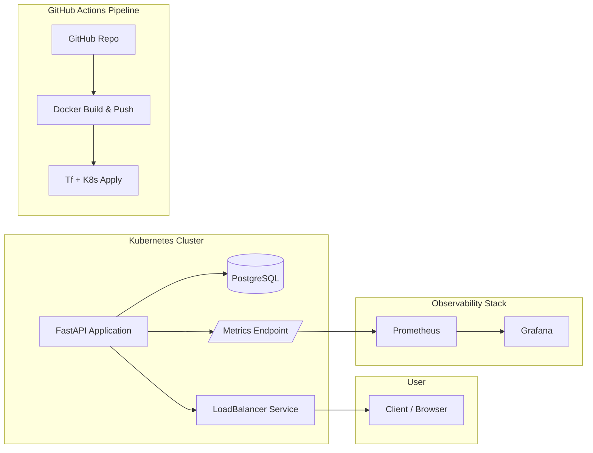

# Journal Starter App

A **FastAPI application** deployed with modern cloud-native practices. This project demonstrates containerization, infrastructure as code, CI/CD automation, Kubernetes orchestration, and observability using Prometheus and Grafana.

## 🖼 Architecture Overview



## 🚀 Setup & Deployment

### 1\. Containerization

- The application is packaged with Docker.

- Image is stored in a container registry (DockerHub/ECR).

Build & push locally:

```bash
docker build -t droffilc1/journal-starter:latest .
docker push droffilc1/journal-starter:latest
```

### 2\. Infrastructure as Code

- Terraform provisions:

  - Compute resources (ECS/Kubernetes nodes)

  - Networking (VPC, subnets, security groups)

  - PostgreSQL database

```bash
cd infra
terraform init
terraform apply -auto-approve
```

### 3\. CI/CD Pipeline

- GitHub Actions workflow (`.github/workflows/`) handles:

  - Build & test on every commit

  - Build & push Docker image

  - Deploy using Terraform & Kubernetes

### 4\. Kubernetes Deployment

- Manifests under `/k8s` define:

  - `Deployment` (FastAPI app & PostgreSQL)

  - `Service` (LoadBalancer for app, ClusterIP for DB)

  - `ConfigMap` and `Secret` for configuration

Deploy:

```bash
kubectl apply -f k8s/
```

### 5\. Monitoring & Observability

- FastAPI exposes `/metrics` endpoint.

- Prometheus scrapes metrics from the app.

- Grafana visualizes key metrics:

  - Request count

  - Error rate

  - Response latency

  - CPU & memory usage

* * *

## 📊 Grafana Dashboards


System Resources

> Grafana JSON exports can be found in `/grafana/provisioning/dashboards/`.

* * *

## 📂 Repository Structure

```bash
.
├── app/                # FastAPI application
├── Dockerfile          # Container definition
├── infra/              # Terraform configs
├── k8s/                # Kubernetes manifests
├── .github/workflows/  # CI/CD pipeline configs
├── grafana/            # Grafana resources
├── prometheus/         # Prometheus resources
└── README.md
```

## ⚡ Quick Start

1. **Run locally with Docker**

```bash
docker build -t journal-starter . docker run -p 8080:8080 journal-starter
```


- **Provision infrastructure**

```bash
cd infra && terraform apply -auto-approve
```

- **Deploy to Kubernetes**

```bash
kubectl apply -f k8s/
```

- **Access Monitoring**

  - Prometheus → `http://localhost:9090`

  - Grafana → `http://localhost:3000`
